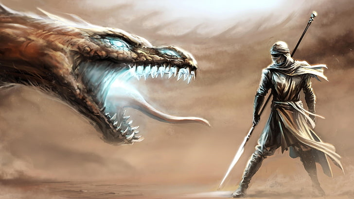

{: width="60%"}

- health: 30
- weapon: [**Dragon's Claw**](../Weapons)
    - made of wood and metal
    - +2 on all attacks


# Spells

## Lvl 1: "up-syk" (Burst-Mode)
```yaml
roll: .
recharge: 1 turn
```

Perform an powered-up action; choose any of the following:

- x4 mod to dash
- x2 mod to damage

Plus:
- burst-rom: add push-back effect (falcon punch);
    - large monster: 1 space
    - medium monster (human): 3 spaces
    - small monster: 6 spaces

Rules:
- only works on self

<!-- 
Secret Uses:
- can burst-rom a friendly to launch them 3 spaces (they take damage)
 -->

## Lvl 2: "rom-star" (Fire Breathing)
```yaml
roll: 1d8
recharge: 3 turns
range: 4 dashes
```

Breath a powerful stream fire towards anyone within 4 dashes

> think: cyclops from x-men, but with fire

- damage rollover can be spread across opponents
- can also make a wall of fire; drop as many "fire tiles" as you have rolls
    - each one deals +2 damage if stepped on
    - each tile has to be adjacent to the last
    - tiles last 2 rounds

<!--
## Lvl 3 (special): "Up-Syk-Inf" (guts mode")
```yaml
roll: 1d20
charge: 1 turn
recharge: 1 day
```

Recharge all spells

Then: Perform an additional number of actions equal to the roll.

Rules:

- can only use if health is less than 5
- can be used in response to getting attacked if resulting is health is 5 or fewer (i.e., a conditional reaction spell)
-->

<!-- 
Secret Combo: have andrew use health syphon to put sean below 5, and then return the health back
 -->

<!-- Nat 20: +2 actions (so, 12 total) -->
