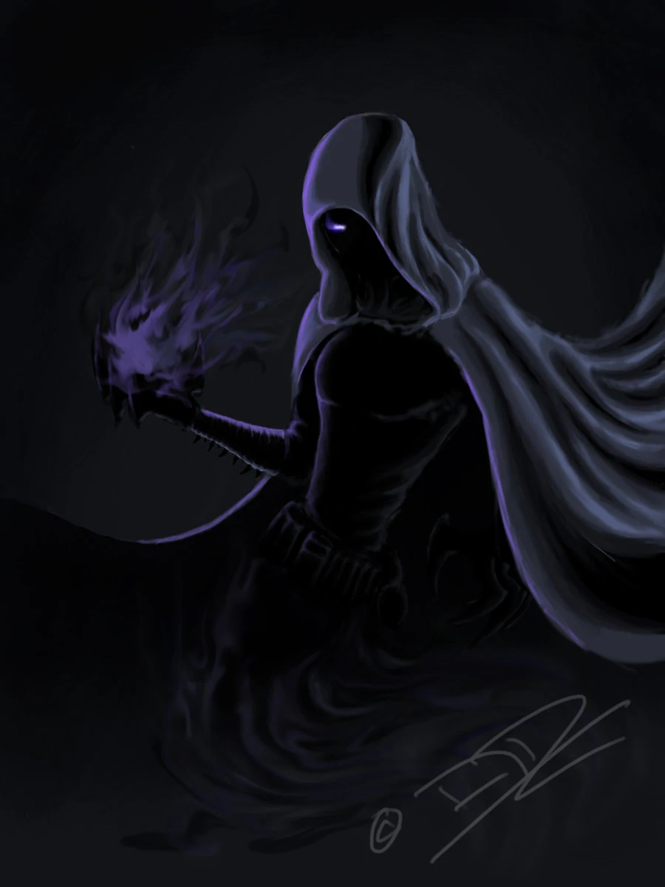

{: width="40%"}

- health: 22
- weapon: [**Snake's Fang**](../Weapons)
  - made of bone attached to a looped rope; worn as a necklace 
  - stun on <= greater monsters (inluding humans)


# Spells

## Lvl 1: "em-vee" (Siphon / Send)
```yaml
roll: 3+ on 1d6 >>
recharge: 1 turn
```

Siphon (requires physical contact): Steal chakra or health from another player:

- health: target takes damage equal to roll
- chakra: 1 turn recharge on all spells

After a siphon, you can "send" the energy back with any the following:

- health: gain health equal to roll - 1 (you or a teammate)
- chakra: recharge a spell (yours or another's)

Sending to another player requires physical contact.

Collected siphon depletes _at the end_ of your next turn.

<!-- 
Special moves:
- steal health from self (or ally), convert to other ally
 -->


## Lvl 2: "foryen-hex ced"(Rapidash)
```yaml
roll: 3+ on 1d6
recharge: 3 turns
```

- Adds 6 movement actions (dashes / dodges) to action set on player's turn
- Can be used as a reaction on any person's turn
  - if you have siphoned energy / chakra, you can _expell_ it during a reaction (but can't pull it)


<!-- ## Lvl 3 (special): "em-vee-star"
```yaml
roll: 6+ on 1d20 >>
charge: 1 turn
recharge: 1 day
```

 --><!-- Player stretches out arms, and emits a piercing pulse wave touching anything within 3 dashes. Any creature (including teammates) caught in pulse: -->

<!-- 
- lose magic for 2 turns 
- including base spells and dodge
- take damage equal to dice rollover / # of creatures in radius


Player gets health equal to dice rollover.

Nat 20: full health
-->
