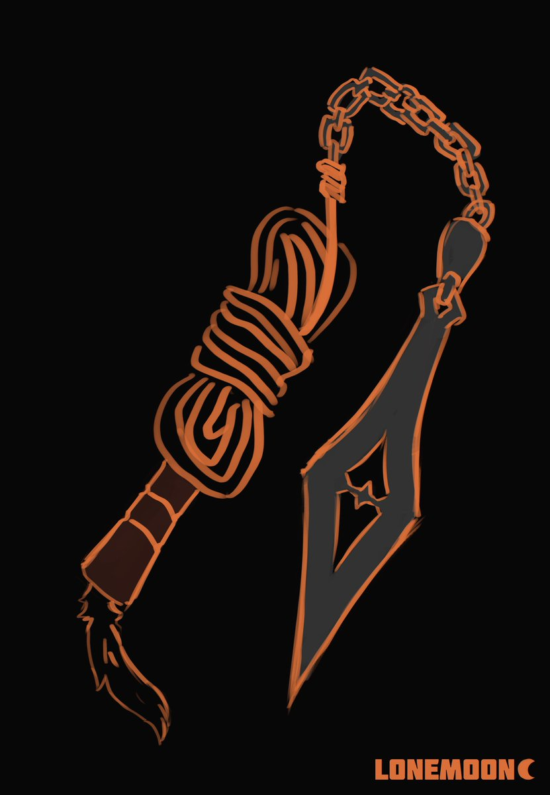

# Crane's Wing (Boomerang)

- made of metal; requires user to wear a metal band around palm
- can be thrown up to 4 dashes

---

# Dragon's Claw (Lance)

- made of wood and metal
- +2 on all attacks

---

# Snake's Fang (Rope Dart)

- made of bone
- attached to a looped rope; worn as a necklace 
- stun on <= greater monsters (inluding Umarians)

